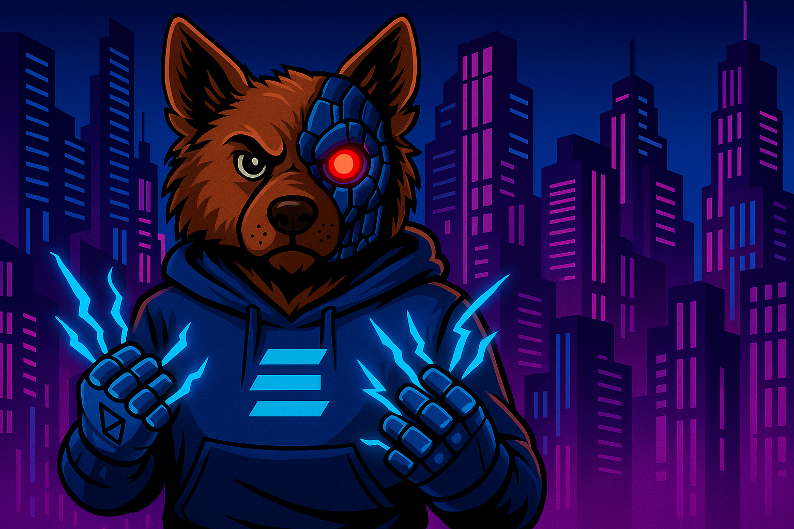

<a href="https://kovu.ai/">
  
  <h1 align="center">Kovu RAG Chatbot</h1>
</a>

<p align="center">
  An advanced, open-source RAG (Retrieval-Augmented Generation) chatbot template built with Next.js and the Vercel AI SDK. This project provides a solid foundation for building powerful, context-aware AI applications with knowledge base capabilities.
</p>

<p align="center">
  <a href="#features"><strong>Features</strong></a> ·
  <a href="#architecture"><strong>RAG Architecture</strong></a> ·
  <a href="#model-providers"><strong>Model Providers</strong></strong></a> ·
  <a href="#running-locally"><strong>Running Locally</strong></a>
</p>
<br/>

## Getting Started

Kovu is a RAG (Retrieval-Augmented Generation) assistant. You can ask it questions about your documents, and it will use them to provide answers.

To get started (ensure you have selected the **Kovu AI with Tools** model):
1.  Upload your documents using the upload button via sidebar.
2.  Ask a question in the chat box.
3.  Kovu will search your documents and generate a relevant answer.

You can also try asking one of the initial questions to learn more about how RAG systems work.

## Features

- **Retrieval-Augmented Generation (RAG)**: Connect your own knowledge base by uploading documents. The chatbot can then retrieve relevant information to provide context-aware and accurate answers.
- **Next.js App Router**: Utilizes the latest Next.js features, including React Server Components (RSCs) and Server Actions for optimal performance and a modern development experience.
- **Vercel AI SDK**: Employs the AI SDK for seamless integration with large language models, providing hooks and utilities for building dynamic chat interfaces.
- **Customizable AI Models**: Natively supports "Kovu AI" models for advanced reasoning and tool usage, and is easily extensible to other providers.
- **Document Handling**: Supports uploading and processing of various document formats for building the knowledge base.
- **Styling with shadcn/ui & Tailwind CSS**: A modern and accessible UI built with the best-in-class tools for easy customization.
- **PostgreSQL Database with JSON Embeddings**: Uses a standard PostgreSQL database to store chat history and vector embeddings (as JSON arrays), with an in-app similarity search.
- **Authentication**: Secure user authentication handled by [Auth.js](https://authjs.dev).

## RAG Architecture

The RAG implementation in this project follows these steps:
1.  **Document Upload**: Users can upload documents through the UI.
2.  **Processing & Chunking**: The documents are parsed and split into smaller, manageable chunks of text.
3.  **Embedding Generation**: Each text chunk is converted into a vector embedding using a sentence-transformer model.
4.  **Vector Storage**: The embeddings are stored as a JSON array in a PostgreSQL database alongside the text chunks.
5.  **Retrieval**: When a user sends a message, the application fetches all document chunks for the user and performs a cosine similarity search in-memory to find the most relevant ones.
6.  **Context Injection**: The retrieved text chunks are injected into the prompt as context for the language model.
7.  **Generation**: The LLM generates a response that is grounded in the provided context, resulting in more accurate and relevant answers.

## Model Providers

This template is configured to use custom **Kovu AI** models out of the box:

- **Kovu AI Deep Think**: An advanced model focused on complex reasoning and generation.
- **Kovu AI with Tools**: A model with capabilities for knowledge search and executing tools.

The underlying Vercel AI SDK makes it easy to switch to other providers like OpenAI, Anthropic, Cohere, and more with minimal code changes.

## Running Locally

To run this project locally, you'll need to set up your environment variables.

1.  **Copy the environment file:**
    ```bash
    cp .env.example .env.local
    ```
2.  **Fill in the environment variables:**
    Open `.env.local` and provide the necessary values for authentication, database, and any AI model provider keys you wish to use.

3.  **Install dependencies and run the development server:**
    ```bash
    pnpm install
    pnpm dev
    ```

Your application should now be running on [http://localhost:3000](http://localhost:3000).
